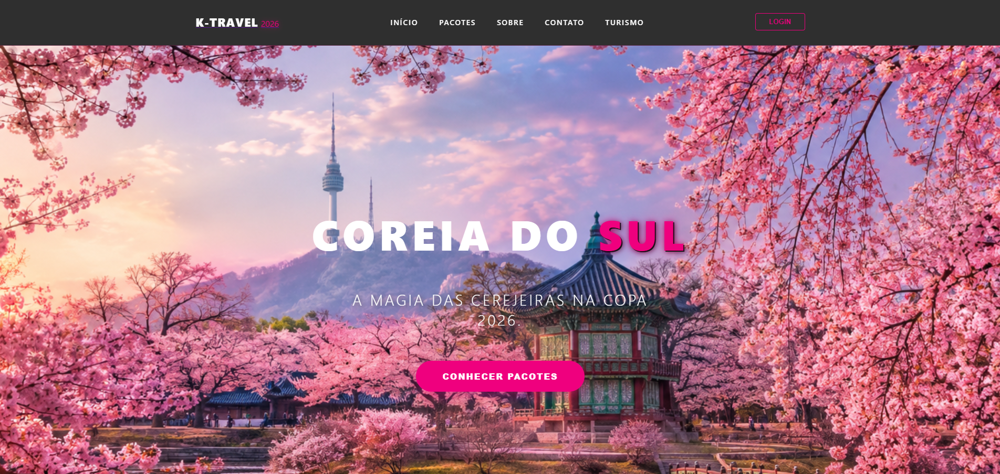
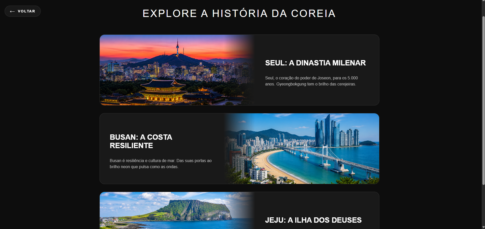
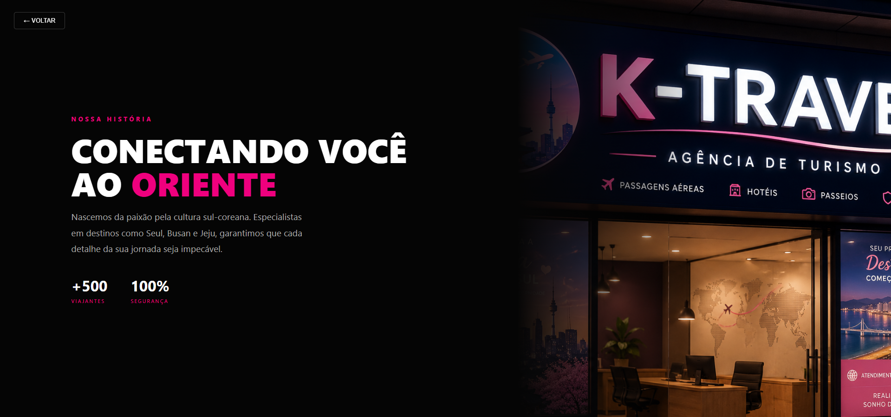

# ✈️ Luxe Seoul | Agência de Viagens Boutique

O **Luxe Seoul** é uma landing page de alto padrão focada em pacotes de viagens exclusivos para a Coreia do Sul. O projeto utiliza uma estética moderna com *Glassmorphism*, componentes responsivos e animações fluidas, desenvolvido para apresentar roteiros únicos, valores e diferenciais da agência, com foco em experiência do usuário (UX) e conversão.

---

## 📸 Screenshots do Projeto

<div align="center">
  <p><strong>Visão Geral e Seção Principal</strong></p>
  
  <br><br>
  <p><strong>Nossos Pacotes Exclusivos</strong></p>
  
  <br><br>
  <p><strong>Interface e Detalhes do Design Premium</strong></p>
  
</div>

---

## 🚀 Projeto Ao Vivo

Acesse a versão completa e publicada do projeto:
👉 [Acessar Luxe Seoul](SEU_LINK_AQUI)

---

## 🛠️ Tecnologias Utilizadas

* **React 19 + Vite:** Base do projeto, garantindo desempenho otimizado e um ambiente de desenvolvimento ágil.
* **React Router Dom:** Gerenciamento de navegação entre páginas, configurado com *basename* para uma implantação perfeita.
* **CSS Modules:** Estilização isolada por componente, evitando conflitos de classes e garantindo uma manutenção simples.
* **Design System:** Estilo *Glassmorphism*, paleta de cores moderna (tons de magenta e escuro), layout totalmente responsivo e animações fluidas.
* **Recursos de Confiança:** Seções dedicadas a segurança, formas de pagamento e avaliações de clientes.

---

## 📦 Funcionalidades Principais

* Apresentação detalhada de pacotes turísticos com valores, destaques e roteiros.
* Chamadas para ação (*CTAs*) claras e intuitivas: "Detalhes" e "Reservar Agora".
* Seções focadas em gatilhos de confiança: ambiente seguro, avaliações positivas e flexibilidade de pagamento.
* Rodapé completo com informações institucionais, suporte e políticas legais.
* Interface totalmente adaptada e otimizada para celulares, tablets e desktops.

---

## 📥 Como Clonar e Executar o Projeto

### Pré-requisitos
* Ter o **Git** instalado.
* Ter o **Node.js** (versão 18 ou superior) instalado.

### Passo a Passo

1. **Clone o repositório:**
```bash
   git clone [https://github.com/Barbara-larissa/luxe-seoul.git](https://github.com/Barbara-larissa/luxe-seoul.git)